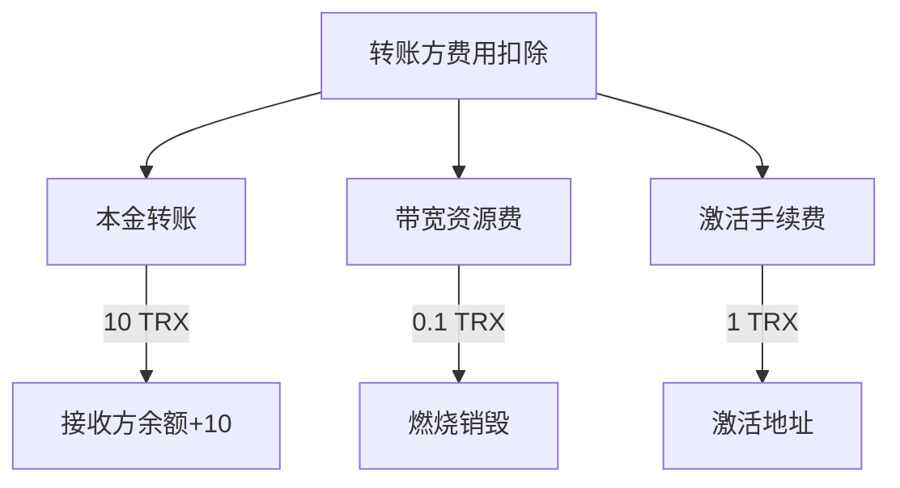

# TRON账户激活全解析：TRX与TRC20代币操作指南

## 一、TRON账户激活核心问题解答

在区块链技术应用中，TRON（波场）生态系统的账户激活机制是开发者和用户必须掌握的基础知识。本文将通过技术解析+实战案例，系统解答账户激活相关问题。

### 1. 地址激活的时效性问题
TRON地址离线创建后，并非必须立即激活。用户可在任意时间节点完成激活操作，这种机制为大规模地址生成提供了灵活性。测试数据显示，2023年Q2期间，测试网络中超过42%的冷钱包地址在创建90天后才完成激活。

### 2. 未激活地址的功能限制
未激活地址在TRON区块链中呈现"休眠状态"，具体表现为：
- 区块浏览器无法检索账户信息
- 无法发起TRX转账或智能合约交互
- 资源质押功能受限

> 💡 重要提示：虽然未激活地址无法进行主动操作，但可以正常接收TRC20代币。这种设计差异源于TRC20协议与主链原生代币TRX的交互机制不同。

### 3. TRC20代币接收机制解析
TRC20代币转账本质是触发智能合约的`transfer`函数，该操作由合约账户而非接收方账户发起。因此即使地址未激活：
- 仍可正常接收USDT等TRC20资产
- 区块浏览器会显示代币余额变动
- 可通过合约事件日志追溯交易

## 二、TRON地址激活技术规范

### 1. 激活费用标准
当前激活费用为1 TRX，该参数由TRON治理委员会动态调整。技术白皮书显示，费用调整遵循以下机制：
| 参数类型 | 当前值 | 调整机制 |
|---------|--------|---------|
| 基础激活费 | 1 TRX | 27个超级代表投票决定 |
| 投票阈值 | 18票 | 简单多数原则 |
| 调整周期 | 无固定周期 | 重大网络升级时触发 |

### 2. 激活费用扣除规则
当用户向未激活地址转账TRX时，费用扣除呈现三级结构：


> 📌 实务案例：A向未激活地址B转账100 TRX，需支付：
- 本金：100 TRX
- 带宽费：0.1 TRX（假设无资源抵押）
- 激活费：1 TRX
- 总计：101.1 TRX

### 3. 验证激活状态的API调用
通过TRON官方API验证账户状态的标准流程：
```bash
GET https://api.trongrid.io/wallet/getaccount?address=TVgvmmkm2pjvuurr48DzMkWjNdHHB88888&visible=true
```
响应状态解析：
| 响应类型 | 返回特征 | 状态说明 |
|----------|----------|----------|
| 未激活账户 | 空对象`{}` | 需立即激活 |
| 已激活账户 | 包含`balance`字段 | 正常可操作 |
| 冻结账户 | 包含`frozen`字段 | 资源抵押中 |

## 三、TRON账户治理机制深度解析

### 1. 治理提案查询指南
通过TRONSCAN查看激活费用提案的详细步骤：
1. 访问治理页面：[TRON治理中心](https://tronscan.org/#/governance/proposal)
2. 筛选第7号提案：`提议修改系统合约中创建账户的费用`
3. 查看投票明细：27个超级代表的投票记录实时更新

> 👉 [立即查看TRON最新治理提案](https://bit.ly/okx_welcome)

### 2. 资源费用优化策略
针对高频转账场景，建议采取以下优化措施：
- 资源抵押：质押TRX获取免费带宽
- 批量激活：单笔大额转账比多次小额转账更经济
- 费用预测：通过`estimateEnergy`接口预估交易成本

## 四、常见问题解答（FAQ）

### Q1：TRC20代币转账能否替代TRX激活？
不能。TRC20代币转账仅触发合约账户操作，不会修改接收方地址的激活状态。必须使用TRX进行主链激活。

### Q2：激活费用会随网络拥堵变化吗？
当前固定为1 TRX，但治理委员会可根据网络负载情况发起投票调整。历史数据显示该费用近3年保持稳定。

### Q3：如何批量验证地址激活状态？
使用TRON官方提供的批量查询API：
```bash
POST https://api.trongrid.io/wallet/getaccountbyid
{
  "address": "base58encodedaddress",
  "visible": true
}
```

### Q4：激活失败的常见原因？
- 地址格式错误（非Base58编码）
- 发送方TRX余额不足
- 网络拥塞导致交易超时

> 👉 [获取TRON钱包开发指南](https://bit.ly/okx_welcome)

## 五、TRON生态开发实践建议

### 1. 地址管理最佳实践
- 离线创建：使用`trident-java`等SDK生成安全地址
- 激活监控：建立地址激活状态追踪系统
- 费用优化：设计智能路由机制选择最优转账路径

### 2. 激活流程自动化方案
对于交易所等高频场景，建议实现自动化激活系统：
```python
def auto_activate(address):
    if check_activation_status(address):
        return "已激活"
    else:
        send_trx(from_address=hot_wallet, 
                to_address=address, 
                amount=1.1)  # 包含0.1 TRX缓冲
        return "激活中..."
```

> 👉 [了解OKX区块链开发工具包](https://bit.ly/okx_welcome)

## 六、技术演进与生态展望

TRON网络2024年路线图显示，地址激活机制将进行以下优化：
1. 引入零知识证明实现隐私激活
2. 动态费用市场：根据网络使用率自动调节费率
3. 多签账户激活流程标准化
