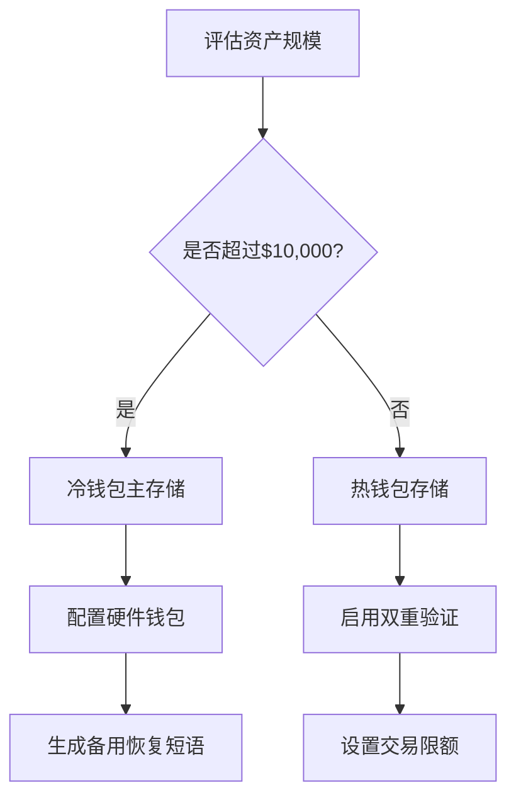

# 什么是加密钱包

## 加密钱包的核心功能解析

加密钱包作为数字资产存储的必备工具，其本质是通过技术手段管理用户的私钥信息。与传统钱包不同，加密钱包并不真正存储加密货币——它们存储的是您的**私钥**。这种加密字符串如同数字密码，是访问和操作加密资产的唯一凭证。当用户完成加密货币交易时，系统会自动生成私钥和对应的**钱包地址**（类似数字账户名）。

私钥的重要性体现在：  
- 证明资产所有权  
- 授权交易操作  
- 管理数字资产权限  

> ⚠️ 重要提示：丢失私钥将永久失去资产访问权，因此建议采用多重备份策略。

## 数字资产存储方式对比

### 热钱包 vs 冷钱包

| 类型   | 存储方式       | 安全性 | 便捷性 | 适用场景               |
|--------|----------------|--------|--------|------------------------|
| 热钱包 | 在线设备存储   | ⭐⭐⭐   | ⭐⭐⭐⭐⭐ | 日常小额交易、频繁操作 |
| 冷钱包 | 离线设备存储   | ⭐⭐⭐⭐⭐ | ⭐⭐     | 大额资产长期存储       |

**热钱包**包含桌面端、移动端和网页端钱包，优势在于操作便捷但易受网络攻击。**冷钱包**如纸质钱包、硬件钱包，通过物理隔离提升安全性，但存在遗失风险。

👉 [深入了解数字资产存储方案](https://bit.ly/okx_welcome)

## 资产托管方式选择指南

### 自主托管与第三方托管对比

- **自主托管**（非托管钱包）  
  适合技术型用户，需自行管理私钥和备份，常见工具有MetaMask、Electrum等。

- **第三方托管**（托管钱包）  
  由专业机构如数字资产平台管理私钥，提供客户支持服务，适合新手用户。

> 📌 关键决策点：  
> 1. 更重视资产控制权还是操作便捷性？  
> 2. 主要用途是长期持有还是高频交易？  
> 3. 是否具备私钥管理能力？

👉 [探索专业托管服务](https://bit.ly/okx_welcome)

## 数字资产管理常见问题解答

**Q：钱包地址区分大小写吗？**  
A：是的，XYZ与xyz可能指向不同钱包，建议使用复制粘贴或二维码扫描避免输入错误。

**Q：如何选择钱包类型？**  
A：小额日常使用推荐热钱包，大额长期存储建议冷钱包组合，可根据资产规模动态调整。

**Q：私钥泄露怎么办？**  
A：立即转移资产到新钱包，联系专业安全机构进行风险排查。

**Q：硬件钱包需要联网吗？**  
A：日常存储无需联网，交易时需通过USB等接口连接设备签名交易。

**Q：如何验证钱包安全性？**  
A：查看官方认证、用户评价，优先选择开源代码项目，定期更新软件版本。

## 数字资产存储决策框架

在选择存储方案时，建议从三个维度进行评估：

1. **资产规模**  
   - 小额持仓可使用热钱包  
   - 大额存储推荐冷钱包+多重签名

2. **使用频率**  
   - 高频交易配置热钱包  
   - 长期持有采用冷存储

3. **技术能力**  
   - 新手选择托管服务  
   - 高级用户可采用混合存储策略

> ⚖️ 风险提示：没有绝对安全的存储方式，建议采用分仓管理，避免单一风险点。

## 数字资产安全实践建议

1. **多重备份策略**  
   - 云端+本地+物理介质三重备份私钥

2. **权限分离机制**  
   - 交易密钥与存储密钥分离管理

3. **定期安全审计**  
   - 检查钱包软件版本  
   - 监控异常登录记录

4. **社交工程防护**  
   - 不随意点击可疑链接  
   - 验证官方认证渠道

👉 [获取专业安全建议](https://bit.ly/okx_welcome)

## 数字资产管理发展趋势

随着区块链技术演进，新型存储方案不断涌现：  
- 多签钱包（多重验证）  
- 社交恢复钱包（社交网络验证）  
- 智能合约钱包（可编程权限管理）

这些创新方案在提升安全性的同时，也带来新的技术挑战。建议用户持续关注行业动态，及时优化存储策略。

> 📈 数据洞察：2023年数字资产存储安全调查显示，采用混合存储策略的用户资产损失率降低67%。

## 数字资产存储决策流程图

通过系统化的决策流程，可以帮助用户建立更科学的数字资产管理体系。

> 🛡️ 行业建议：建议将不超过20%的资产存放于热钱包，其余采用冷存储方案，并定期进行安全演练。

## 数字资产存储成本分析

| 存储类型   | 初期投入 | 年维护成本 | 安全系数 | 适用人群           |
|------------|----------|------------|----------|--------------------|
| 软件钱包   | ￥0-200  | ￥0        | ⭐⭐⭐     | 新手用户           |
| 硬件钱包   | ￥300-800| ￥0        | ⭐⭐⭐⭐⭐   | 长期投资者         |
| 多签服务   | ￥500+   | ￥200/年   | ⭐⭐⭐⭐⭐   | 机构投资者         |
| 纸质钱包   | ￥50     | ￥0        | ⭐⭐⭐⭐     | 极简主义者         |

成本效益分析显示，硬件钱包在安全性和性价比方面表现最优，适合多数中长期持有者。

通过系统化的存储方案设计，可以有效降低数字资产风险，同时兼顾操作便利性。建议用户根据自身需求建立动态调整机制，确保资产安全。