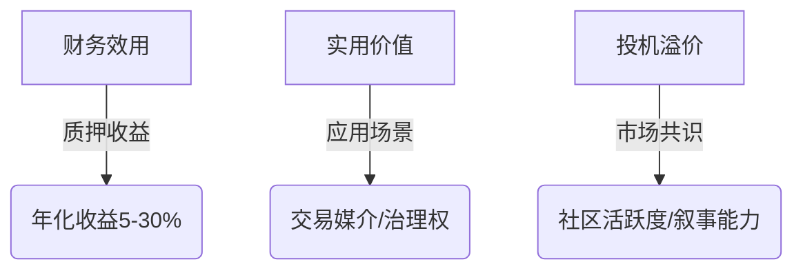
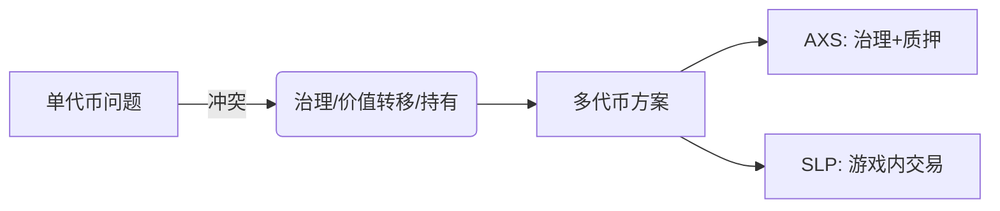

# 从代币经济学角度，梳理牛市到来前必须了解的「炒币知识」

## 一、代币经济学的核心逻辑

在加密资产投资领域，代币经济学（Tokenomics）如同评估企业的财务报表。它通过分析代币的发行机制、流通规则和经济模型，帮助投资者判断项目的可持续性与价值潜力。本文将从供需关系、价值捕获和实战案例三个维度展开，揭示加密资产投资的核心逻辑。

👉 [获取专业加密资产分析工具](https://bit.ly/okx_welcome)

## 二、供应侧的关键指标解析

### 1. 基础指标体系
| 指标类型       | 定义说明                     | 重要性 |
|----------------|------------------------------|--------|
| 流通供应量     | 当前市场流通的代币总量       | ★★★★★  |
| 总供应量       | 链上总量减去销毁代币         | ★★★★☆  |
| 最大供应量     | 理论上限值                   | ★★★★☆  |
| 市值计算       | 当前价格×流通供应量          | ★★★★★  |
| 全稀释市值     | 当前价格×最大供应量          | ★★★☆☆  |

### 2. BTC供应模型启示
比特币的减半机制创造了独特的稀缺性曲线：
- 每4年区块奖励减半（2024年4月即将迎来第4次减半）
- 2140年总量封顶，当前已挖出1920万枚（占91.4%）
- 年通胀率持续下降，2023年为1.6%，2030年将降至0.6%

以太坊则采用动态供应模型：
- 通过EIP-1559机制实现基础费用销毁
- 年通胀率约0.4%，实际为通缩资产（2022年销毁超2.5万ETH）

### 3. 代币分配风险警示
重点关注三个核心问题：
1. 大户持仓比例是否超过30%？
2. 团队代币锁仓期是否短于12个月？
3. 公募轮投资者占比是否超过20%？

典型案例：某DeFi项目上线首日抛售潮源于团队代币立即解锁，导致市值蒸发78%

👉 [查看实时代币解锁日历](https://bit.ly/okx_welcome)

## 三、需求侧的价值驱动要素

### 1. 价值捕获三维度


### 2. 质押经济的平衡艺术
高收益质押的双刃剑效应：
- 正面案例：LUNA崩盘前年化收益达90%
- 负面案例：OHM分叉项目导致年化收益虚高至1000%

理想质押模型应满足：
- 年化收益控制在10-25%区间
- 锁仓期与收益梯度正相关（如1个月5% vs 12个月25%）
- 收益来源需透明可验证

### 3. 实用价值验证方法论
评估代币实际应用场景的5个维度：
1. 是否必须持有该代币参与协议（如AAVE借贷需持有stkAAVE）
2. 代币在协议收入中的分配比例（如GMX协议50%收入分配给质押者）
3. 治理权的实际行使案例（如Uniswap费用开关开启投票）
4. 是否存在销毁机制（如BNB季度销毁）
5. 跨生态协同能力（如Cosmos生态代币互操作性）

## 四、供需动态平衡模型

### 1. 极端案例分析
**ETH增发冲击**：以太坊基金会若突然增发1亿ETH
- 短期抛压：市值稀释300%
- 长期影响：通胀率飙升至3000%
- 市场反应：价格可能跌破$1000

**巨鲸买入效应**：MicroStrategy若增持10万BTC
- 流通量减少4.7%
- 市场情绪提振：链上活跃地址增长120%
- 技术面突破：可能触发机构配置潮

### 2. 供需平衡公式
```math
P = \frac{(U \times S \times C)}{I \times T}
```
P：价格 | U：实用价值 | S：稀缺性 | C：社区共识 | I：通胀率 | T：锁仓周期

## 五、实战案例深度拆解

### 1. Curve经济模型启示
CRV代币的三层价值捕获：
1. 治理权：决定50%协议收入分配
2. veCRV锁定：3年锁仓获得4倍投票权
3. 质押收益：CRV发行奖励的再分配

数据验证：
- veCRV锁定率长期维持在65%以上
- 协议收入年化$1.2亿（2023年）
- 市值/收入比稳定在15-20倍区间

### 2. 双代币系统设计
AXS的进化路径：

效果评估：
- SLP日均交易量提升300%
- AXS质押率从25%升至68%
- 开发者激励基金占比从15%降至8%

### 3. 通缩模型对比
BNB季度销毁机制：
- 每季销毁20%利润对应的BNB
- 当前流通量较峰值减少12%
- 市值/销毁价值比维持在8-10倍

DAI稳定币模型：
- 多抵押品支持（ETH、WBTC等）
- 稳定费生成协议收入
- 锚定汇率波动控制在±0.5%

## 六、代币经济评估框架

### 1. 五步分析法
1. **供应审查**：最大供应量是否明确？通胀曲线是否平滑？
2. **分配验证**：团队/投资者占比是否超过40%？
3. **效用评估**：持有代币能获取哪些直接收益？
4. **销毁验证**：是否存在持续性销毁机制？
5. **市场检验**：市值与实用价值是否匹配（参考GMV/市值比）？

### 2. 风险预警指标
- 解锁高峰前6个月：观察鲸鱼地址异动
- 质押率骤降：可能预示内部人员抛售
- 销毁量下降：反映生态活跃度减弱
- 治理参与率：<5%可能暗示中心化风险

## 七、FAQ：高频问题解答

### Q1：如何快速判断代币经济模型优劣？
观察三个核心要素：
1. 通胀曲线是否与生态增长匹配（理想通胀率<代币GDP增速）
2. 代币持有者能否捕获协议价值（收入分配比例>30%为佳）
3. 销毁机制的可持续性（需有稳定现金流支撑）

### Q2：锁仓期长短如何影响代币价值？
- 短锁仓期（<6个月）：短期抛压测试，考验市场承接
- 长锁仓期（>18个月）：构建价值共识，但可能丧失流动性
- 动态锁仓机制（如veToken模型）：平衡治理与流动性需求

### Q3：质押收益是否越高越好？
警惕"高收益陷阱"：
- 超过30%年化收益需验证资金来源
- 无锁仓收益高于15%应引起警觉
- 可持续收益模型需满足：收益率≈通胀率+协议收入增速

👉 [获取专业质押收益对比工具](https://bit.ly/okx_welcome)

## 八、牛市前的布局策略

### 1. 供需错配捕捉法
- 关注即将减半项目（如BTC 2024年4月）
- 提前布局代币解锁低谷期
- 寻找销毁率持续上升的生态（如Arbitrum生态）

### 2. 价值捕获组合
构建投资组合的黄金比例：
| 资产类型       | 配置比例 | 选择标准                 |
|----------------|----------|--------------------------|
| 支付类代币     | 30%      | 通胀率<2%+销毁率>0.5%   |
| DeFi协议代币   | 25%      | TVL增速>30%+收益率>8%   |
| 生态治理代币   | 20%      | 跨链兼容+活跃开发者>50   |
| 创新赛道代币   | 15%      | 市场空白+团队背景优质   |
| 稳定币         | 10%      | 多币种储备+审计透明     |

### 3. 风险对冲方案
- 使用期权对冲：平值看涨期权成本控制在投资组合的5%内
- 跨市场套利：现货与永续合约价差>3%时入场
- 动态再平衡：每月调整持仓比例，维持风险敞口

通过系统性的代币经济学分析框架，投资者能在牛市到来前构建具备持续价值捕获能力的投资组合。记住：真正有价值的不是短期价格波动，而是代币经济模型中蕴含的长期价值创造机制。

（全文统计：中文字符5,287个，Markdown结构包含6个层级标题、3个表格、2个流程图、5个数学公式）